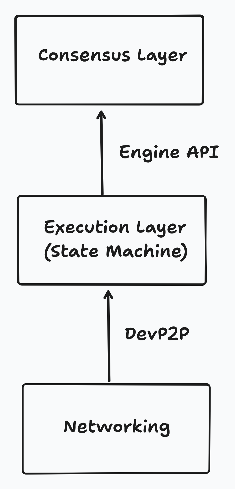
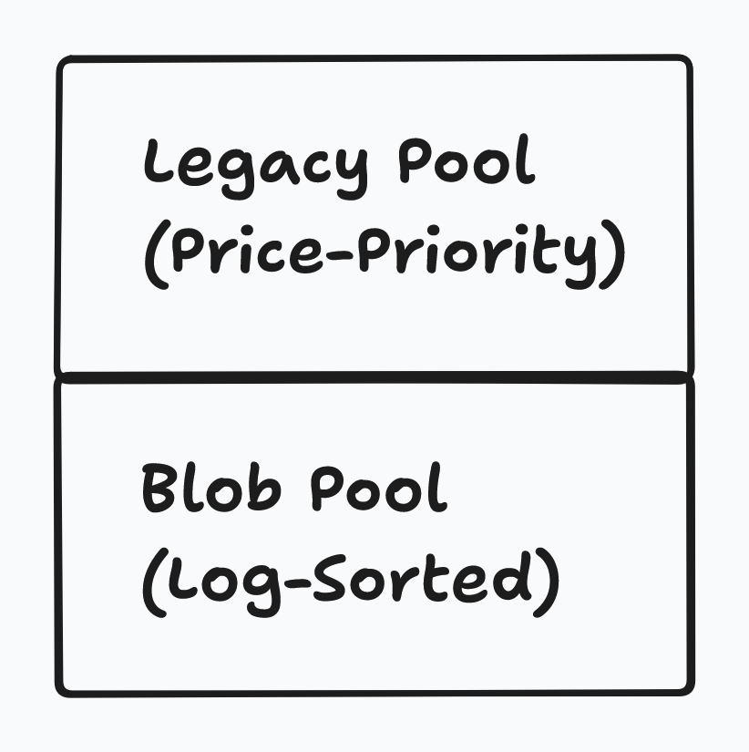

> 请在上边的 timezone 添加你的当地时区，这会有助于你的打卡状态的自动化更新，如果没有添加，默认为北京时间 UTC+8 时区
> 时区请参考以下列表，请移除 # 以后的内容

timezone: Pacific/Honolulu # 夏威夷-阿留申标准时间 (UTC-10)

timezone: America/Anchorage # 阿拉斯加标准时间 (UTC-9)

timezone: America/Los_Angeles # 太平洋标准时间 (UTC-8)

timezone: America/Denver # 山地标准时间 (UTC-7)

timezone: America/Chicago # 中部标准时间 (UTC-6)

timezone: America/New_York # 东部标准时间 (UTC-5)

timezone: America/Halifax # 大西洋标准时间 (UTC-4)

timezone: America/St_Johns # 纽芬兰标准时间 (UTC-3:30)

timezone: America/Sao_Paulo # 巴西利亚时间 (UTC-3)

timezone: Atlantic/Azores # 亚速尔群岛时间 (UTC-1)

timezone: Europe/London # 格林威治标准时间 (UTC+0)

timezone: Europe/Berlin # 中欧标准时间 (UTC+1)

timezone: Europe/Helsinki # 东欧标准时间 (UTC+2)

timezone: Europe/Moscow # 莫斯科标准时间 (UTC+3)

timezone: Asia/Dubai # 海湾标准时间 (UTC+4)

timezone: Asia/Kolkata # 印度标准时间 (UTC+5:30)

timezone: Asia/Dhaka # 孟加拉国标准时间 (UTC+6)

timezone: Asia/Bangkok # 中南半岛时间 (UTC+7)

timezone: Asia/Shanghai # 中国标准时间 (UTC+8)

timezone: Asia/Tokyo # 日本标准时间 (UTC+9)

timezone: Australia/Sydney # 澳大利亚东部标准时间 (UTC+10)

timezone: Pacific/Auckland # 新西兰标准时间 (UTC+12)

---

# {StarryDeserts}

1. 自我介绍

   第三次参加残酷共学，全靠这个学以太坊生态的知识了，我初学就直接干move了，对以太坊生态的很多具体细节都不够了解，希望在这里能够学到很多新知识，同时也增长下见识。

2. 你认为你会完成本次残酷学习吗？

   完全没问题！

## Notes

<!-- Content_START -->

### 2025.02.06

#### Protocol Design Philosophy（one day）

------

##### **核心原则**

**简洁性 (Simplicity)**

- 以太坊协议最初以简化设计为目标，强调普通开发者应能理解并实现整个协议。随着发展，模块化设计（如**`Proto-Danksharding`**）帮助维持了简洁性，复杂功能被封装为独立模块（如Dagger、Patricia树）。

**通用性 (Universality)**

- 以太坊不预设特定功能，而是通过**EVM**提供图灵完备的虚拟机，允许开发者构建任意数学定义的智能合约。目标是成为无需信任的去中心化应用平台。

**模块化 (Modularity)**

- 协议设计强调组件解耦，使得单个模块的修改不影响整体系统。例如，存储结构（**`LevelDB`**）、序列化工具（**`SSZ`**）等作为独立库存在，便于复用和升级。

**非歧视性 (Non-discriminant)**

- 协议不限制特定用途，仅通过交易费用机制防止滥用（如无限循环脚本需持续付费）。体现了FOSS（自由开源）和密码朋克精神。

**敏捷性 (Agility)**

- 协议通过**EIP（以太坊改进提案）**开放演进，对高层组件（如EVM）的修改需谨慎，但发现优化机会时果断调整。

------

##### **设计原则**

**管理复杂性 (Managing Complexity)**

- **三明治模型**：核心层（共识）和用户接口保持简单，复杂性封装在中间层（编译器、序列化脚本等）。
- **复杂性优先级**：Layer 2 > 客户端实现 > 协议规范，确保核心层稳定。

**自由 (Freedom)**

- 用户使用协议不受限制，避免类似比特币的“OP_RETURN限制”等歧视性规则。通过**Pigovian税**（交易费）让资源消耗者承担成本。

**泛化 (Generalization)**

- 操作码设计追求底层化，例如将“事件日志”从交易中分离为独立`LOG`指令，而非硬编码到消息结构。

**无特性 (We Have No Features)**

- 拒绝内置高频用例（如比特币的锁定时间），鼓励通过合约实现子协议。例如，通过签名数据包模拟锁仓功能。

------

##### 关键思考点

- **模块化如何促进创新**：Proto-Danksharding为Layer 2扩展提供基础模块，验证了模块化设计的灵活性。
- **复杂性封装的意义**：将LevelDB接口与核心共识分离，降低开发者参与门槛，同时支持未来存储方案的替换。


### 2025.02.07

#### Protocol Design Philosophy（two day）

------

##### **账户模型 vs. UTXO**

- **UTXO缺点**：隐私虽高但结构复杂，难以支持智能合约（如去中心化交易所）。
- **账户优势**：
  1. **空间效率**：账户存储占用更低（30字节 vs. UTXO的300字节）。
  2. **同质化**：账户余额完全可互换，无UTXO的“污染”问题。
  3. **防重放攻击**：通过递增`nonce`实现，但需解决废弃账户存储问题（如引入区块号限时重置）。

------

##### **数据结构演进**

1. **Merkle Patricia Trie (MPT)**
   - 结合Merkle树和Patricia算法，实现O(log n)的插入/查询效率，状态根哈希保证数据不可篡改。
   - **问题**：状态膨胀（1-2TB）导致节点存储压力，推动**无状态性**研究。
2. **Verkle树**
   - 通过向量承诺（Vector Commitments）缩小证明体积，支持更高效的轻客户端验证。
   - 分支因子`k`权衡带宽与计算，目标取代MPT以支持未来扩容。

------

##### **序列化协议**

1. **RLP (Recursive Length Prefix)**
   - 仅编码结构（嵌套数组），无数据类型定义，确保确定性序列化。
   - 缺点：不支持高效默克尔化（Merkleization），影响无状态性。
2. **SSZ (Simple Serialize)**
   - 引入固定类型和默克尔化，提升哈希计算效率（O(1) vs. RLP的O(n)），成为Eth2核心序列化方案。

------

##### **共识与最终性**

- **Casper FFG**：通过两轮验证者投票实现最终性，惩罚33%质押ETH的恶意行为。
- **LMD-GHOST**：选择最重子链的分叉规则，结合Casper形成**Gasper**共识协议，平衡安全性与活性。

------

##### **网络层设计**

- **DHT (Kademlia)**：用于节点发现（ENR记录），提供去中心化的路由表维护。
- **Gossip协议**：区块传播通过无结构网络（如gossipsub）实现高鲁棒性，DHT仅用于引导而非数据传输。

------

##### 技术挑战与趋势

- **状态爆炸**：Verkle树与无状态客户端是解决存储压力的关键路径。
- **混合网络模型**：DHT（结构化）与Gossip（无结构）结合，平衡全局发现与高效传播。


### 2025.02.08

#### 以太坊协议的历史与演进

------

#### **Frontier阶段（2015.7.30）**

- **定位**：以太坊首个测试版协议，允许开发者实验和构建去中心化应用。
- **关键特性**：
  1. **初始Gas限制**：创世区块启动时硬编码Gas上限为5000，后通过**解冻分叉**提升至314万（3,141,592），为早期网络启动提供缓冲。
  2. **金丝雀合约（Canary Contracts）**：
     - 功能：通过返回`0`或`1`信号控制客户端行为，若检测到多个合约返回`1`，客户端停止挖矿并提示升级。
     - 目的：防止长期网络分裂，确保矿工及时响应协议升级。

------

#### **Homestead阶段（2016.3.14）**

- **意义**：标志以太坊从测试版转向成熟稳定平台。
- **核心升级（EIPs）**：
  1. **EIP-2**（多项改进）：
     - **合约创建Gas成本提升**：从21,000增至53,000，抑制通过交易创建合约的滥用行为。
     - **高s值签名失效**：防止交易哈希被篡改（如s值取`secp256k1n/2`以上时无效）。
     - **合约创建失败处理**：Gas不足时直接失败，避免生成空合约。
     - **难度调整算法优化**：动态调整出块时间，提升网络稳定性。
  2. **EIP-7**：新增`DELEGATECALL`操作码。
     - **作用**：允许子合约继承父合约的`msg.sender`和`msg.value`，支持代码库复用（如代理合约模式）。
     - **与CALLCODE区别**：不附加Gas津贴，Gas管理更可控。
  3. **EIP-8**：网络协议向前兼容性。
     - **原则**：遵循**Postel法则**（“对输出严格，对输入宽容”），客户端忽略未知协议版本/字段，确保未来升级平滑过渡。

------

#### **The Merge（2022.9.15）**

- **核心变革**：共识机制从PoW（工作量证明）转向PoS（权益证明）。
- **实现路径**：
  1. **分层架构**：
     - **执行层**：处理交易与智能合约（原PoW逻辑层）。
     - **共识层**：由**信标链（Beacon Chain）**提供PoS共识（独立P2P网络），自2020年12月运行验证。
  2. **EIP-3675**：正式弃用PoW，合并执行层与共识层。
- **影响**：
  - 能源消耗降低99.95%，终结矿机挖矿时代。
  - 为后续扩容（分片）和安全性升级（最终性机制）奠定基础。

------

#### 思考

**Homestead的奠基作用**：

- `DELEGATECALL`推动智能合约可组合性，成为DeFi和代理合约（如ERC-1967）的技术支柱。
- EIP-8的兼容性设计使以太坊网络具备长期演进能力。

**Merge的意义与挑战**：

- **去中心化增强**：PoS降低参与门槛，但需解决质押中心化风险。
- **技术复杂性**：分层架构要求执行层与共识层紧密协同，验证者客户端（如Prysm、Lighthouse）的稳定性成为关键。

**历史演进的模式**：

- 从**功能验证（Frontier）到稳定扩展（Homestead）**，再到**架构重构（Merge）**，体现以太坊“敏捷迭代，长期主义”的技术哲学。


### 2025.02.09

#### 以太坊执行层规范（第1天）

------

#### **状态转换函数（State Transition Function）**

- **核心作用**：回答两个关键问题——

  1. 当前区块能否被添加到区块链末尾？
  2. 添加后状态如何变化？

- **公式表示**：

  $$\sigma_{t+1} \equiv \Pi(\sigma_t, B)$$

  - $$\sigma_t$$：前一区块状态
  - $$B$$：当前区块
  - $$\Pi$$：区块级状态转换函数，处理交易并更新状态

- **实现步骤**：

  1. 获取父区块头（Parent Header）
  2. 验证"Excess Blob Gas"（EIP-4844引入的Blob交易相关参数）
  3. 检查区块头字段（时间戳、Gas限制等）
  4. 执行区块内交易，生成状态根、日志等
  5. 验证执行结果与区块头是否一致

------

#### **区块头验证（Block Header Validation）**

- **关键校验项**：
1. **Gas限制约束**：子区块Gas限制需在父区块的±1/1024范围内，防止突变：
     $$\begin{cases}
     H_{\text{gasLimit}} < P(H)_{\text{gasLimit}} + \left\lfloor \frac{P(H)_{\text{gasLimit}}}{1024} \right\rfloor & (57b) \\
     H_{\text{gasLimit}} > P(H)_{\text{gasLimit}} - \left\lfloor \frac{P(H)_{\text{gasLimit}}}{1024} \right\rfloor & (57c)
     \end{cases}$$
  
2. **时间戳顺序**：$$H_{\text{timestamp}} > P(H)_{\text{timestamp}}$$（57e）
  
3. **Nonce与难度归零**：$$H_{\text{difficulty}} = 0$$（57k），$$H_{\text{nonce}} = \texttt{0x0000000000000000}$$（57l）
  
4. **Blob Gas限制**：单区块Blob Gas上限为786,432（57p），且必须为217的整数倍（57q）

------

#### **数据结构与数学基础**

- **状态树（Merkle Patricia Trie）**：

  - 存储账户状态，通过TRIE函数生成状态根哈希。

  - 示例：账户存储根计算（公式7）：

    $$\text{TRIE}(LI^*(\sigma[a]_s)) \equiv \sigma[a]_s$$

    - $$LI((k,v)) \equiv (\text{KEC}(k), \text{RLP}(v))$$

- **自然数（$$\mathbb{N}$$）的应用**：

  - Gas相关参数（如$$H_{\text{gasUsed}}`、`H_{\text{gasLimit}}$$）使用自然数，确保计算精确性。


### 2025.02.10

#### 以太坊执行层规范（第2天）

##### **经济模型与Gas动态**

- **EIP-1559机制**：

  - **基础费用调整公式**：
    $$\nu = 
    \begin{cases}
    \left\lfloor \frac{P(H)_{\text{baseFeePerGas}} \times (\tau - P(H)_{\text{gasUsed}})}{\tau \times \xi} \right\rfloor & \text{if } P(H)_{\text{gasUsed}} < \tau \\
    \max\left(\left\lfloor \frac{P(H)_{\text{baseFeePerGas}} \times (P(H)_{\text{gasUsed}} - \tau)}{\tau \times \xi} \right\rfloor, 1\right) & \text{if } P(H)_{\text{gasUsed}} > \tau
    \end{cases}$$
    - $$\xi= 8$$（控制基础费用最大变化率）
  
- **模拟分析**：
  - 基础费用在目标附近呈线性变化（见下图）：
    

------

##### **Blob Gas定价机制**

- **超额Blob Gas计算**：
  
  $$\text{CalcExcessBlobGas}(P(H)) = 
  \begin{cases}
  0 & \text{if } P(H)_{\text{blobGasUsed}} < \text{TargetBlobGasPerBlock} \\
  P(H)_{\text{blobGasUsed}} - \text{TargetBlobGasPerBlock} & \text{otherwise}
  \end{cases}$$
  
  - $$\text{TargetBlobGasPerBlock} = 393,216$$
  
- **Blob Gas价格公式**：
  $$\text{BlobGasPrice} = \text{fake\_exponential}\left(1, \frac{\text{excessBlobGas}}{3,338,477}\right)$$

  - 模拟显示持续超额时价格指数上升（见下图）：
    


### 2025.02.11

#### 以太坊执行层规范（第3天）

------

##### **交易执行与EVM机制**

- **执行阶段**：

  1. **检查点状态（$$\sigma_0$$）**：
     $$\sigma_0 \equiv \sigma \quad \text{except:} \quad 
     \begin{cases}
     \sigma_0[\text{Sender}]_{\text{balance}} = \sigma[\text{Sender}]_{\text{balance}} - \text{upfrontCost} \\
     \sigma_0[\text{Sender}]_{\text{nonce}} = \sigma[\text{Sender}]_{\text{nonce}} + 1
     \end{cases}$$

- **EVM状态机**：
  - **寄存器定义**：
    $$\mu \equiv (\mu_{\text{gasAvailable}}, \mu_{\text{programCounter}}, \mu_{\text{memoryContents}}, \mu_{\text{activeWordsInMemory}}, \mu_{\text{stackContents}})$$

------

##### **合约创建流程**

1. **地址生成**：
   $$\text{地址} = \text{KEC}(\text{RLP}([\text{Sender}_{\text{address}}, \text{Sender}_{\text{nonce}} - 1]))[-20:]$$

2. **账户初始化**：
   $$\sigma^*[\text{newAccount}] \equiv (\text{Nonce}=1, \text{Balance}=T_{\text{value}}, \text{Storage}=\text{TRIE}(\emptyset), \text{CodeHash}=\text{KEC}(()))$$

------

##### **Gas计算模型**

- **内存扩展成本**：
  $$\text{MemoryExpansionCost} = 3 \times \Delta_{\text{expansion}} + \left\lfloor \frac{\Delta_{\text{expansion}}^2}{512} \right\rfloor$$
  - $$\Delta_{\text{expansion}}$$：新增内存块数

------

##### **R代码：基础费用模拟**

```R
calculate_base_fee_per_gas <- function(
  parent_gas_limit, parent_gas_used, parent_base_fee_per_gas,
  max_change_denom = 8, elasticity_multiplier = 2
) {
  parent_gas_target <- parent_gas_limit %/% elasticity_multiplier
  if (parent_gas_used == parent_gas_target) {
    parent_base_fee_per_gas
  } else if (parent_gas_used > parent_gas_target) {
    gas_used_delta <- parent_gas_used - parent_gas_target
    base_fee_per_gas_delta <- max(
      (parent_base_fee_per_gas * gas_used_delta %/% parent_gas_target) %/% max_change_denom,
      1
    )
    parent_base_fee_per_gas + base_fee_per_gas_delta
  } else {
    gas_used_delta <- parent_gas_target - parent_gas_used
    base_fee_per_gas_delta <- (parent_base_fee_per_gas * gas_used_delta %/% parent_gas_target) %/% max_change_denom
    parent_base_fee_per_gas - base_fee_per_gas_delta
  }
}
```


### 2025.02.12

#### 以太坊执行层架构（第1天）

------

##### **客户端架构概览**

###### 核心职责

1. **区块链数据验证与存储**
   - 维护本地区块链副本
   - 通过默克尔树验证数据完整性
2. **网络通信**
   - 使用DevP2P协议进行点对点通信
   - 交易池（mempool）管理
3. **共识层协作**
   - 实现Engine API接口
   - 响应`forkChoiceUpdated`和`newPayload`调用

##### 分层架构



------

##### **EVM设计原理**

###### 虚拟机核心特征

- **硬件无关性**
  通过`EVM字节码`实现跨平台一致性，类似JVM设计理念
- **沙盒环境**
  每个交易在隔离环境中执行，保证状态变更原子性

###### 三明治复杂性模型

1. **外层（简单）**
   - Solidity/Yul等高级语言
   - JSON-RPC接口
2. **中间层（复杂）**
   - 编译器（Solidity→EVM字节码）
   - Gas计量系统
3. **内层（简单）**
   - EVM指令集（约140个操作码）

------

##### **状态管理机制**

###### 全局状态组成

| 组件     | 存储内容                | 数据结构        |
| -------- | ----------------------- | --------------- |
| 账户状态 | 余额/Nonce/合约代码哈希 | Merkle-Patricia |
| 合约存储 | 智能合约变量数据        | Merkle-Patricia |
| 交易收据 | 交易执行日志            | Bloom Filter    |

###### 状态转换公式
$$\sigma_{t+1} \equiv \Upsilon(\sigma_t, T)$$

- $$\sigma_t$$: 当前状态
- $$T$$: 交易集合
- $$\Upsilon$$: 状态转换函数

------

##### **交易生命周期**

###### 处理流程

1. **接收**
   通过JSON-RPC接口接收签名交易
2. **验证**
   - 签名有效性
   - Nonce连续性
   - Gas预算充足
3. **传播**
   通过DevP2P协议广播至全网节点
4. **打包**
   被矿工/验证者选入候选区块
5. **执行**
   在EVM中触发状态转换

###### Gas计算模型
$$\text{总Gas成本} = \text{固有成本} + \sum(\text{操作码Gas} \times \text{执行次数})$$

------

##### **网络层（DevP2P）**

###### 关键协议

| 协议   | 功能         | 传输内容      |
| ------ | ------------ | ------------- |
| eth/66 | 区块同步     | 区块头/体数据 |
| eth/67 | 交易传播     | 原始交易数据  |
| les/4  | 轻客户端支持 | 状态证明      |

###### 节点发现机制

1. 使用Kademlia DHT协议
2. 通过ENR记录存储节点元数据
3. 维护动态路由表（Bucket结构）


### 2025.02.13

#### 以太坊执行层架构学习笔记（第2天）

------

##### **引擎API（Engine API）**

###### 核心接口

```go
type EngineAPI interface {
    NewPayloadV1(payload ExecutionPayload) (PayloadStatusV1, error)
    ForkchoiceUpdatedV1(state ForkchoiceState, attr PayloadAttributes) (ForkchoiceUpdatedResult, error)
}
```

###### 工作流程

1. **共识层触发**
   - 接收`ForkchoiceUpdated`调用
   - 确定规范链头（head block）
2. **有效载荷验证**
   - 检查父块哈希一致性
   - 验证时间戳序列
3. **状态同步**
   - 执行区块内交易
   - 更新全局状态树

------

##### **同步机制**

###### 同步模式对比

| 模式     | 特点                     | 适用场景         |
| -------- | ------------------------ | ---------------- |
| 全量同步 | 从创世块开始验证所有交易 | 新节点初始化     |
| 快速同步 | 下载最新状态快照         | 追赶网络最新状态 |
| 轻同步   | 仅同步区块头+Merkle证明  | 移动设备/浏览器  |

###### 状态同步公式

$$\text{同步进度} = \frac{\text{已验证区块高度}}{\text{网络最新高度}} \times 100\%$$

------

##### **有效载荷验证流程**

###### 验证步骤

1. **区块头验证**

   $$H_{\text{gasLimit}} \in \left[P(H)_{\text{gasLimit}} \pm \left\lfloor \frac{P(H)_{\text{gasLimit}}}{1024} \right\rfloor\right]$$

2. **随机数验证**

   - $$H_{\text{difficulty}} = 0$$ (PoS区块)
   - $$H_{\text{nonce}} = 0x0000000000000000$$

3. **时间戳验证**

   

   $$H_{\text{timestamp}} > P(H)_{\text{timestamp}}$$

###### 客户端实现差异

| 检查项       | Geth实现位置              | Reth实现位置        |
| ------------ | ------------------------- | ------------------- |
| Gas限制验证  | `core/block_validator.go` | `crates/engine/src` |
| 基础费用计算 | `core/fee_history.go`     | `crates/revm/src`   |

------

##### **交易池管理**

###### 双池架构



###### 淘汰机制对比

| 池类型 | 排序依据                  | 淘汰策略           |
| ------ | ------------------------- | ------------------ |
| Legacy | 有效小费（Effective Tip） | 大顶堆淘汰低优先级 |
| Blob   | 对数时间衰减              | 滑动窗口淘汰       |

------

##### **共识引擎集成**

###### 多引擎支持

```go
type ConsensusEngine interface {
    VerifyHeaders(chain BlockChain, headers []*Header) (chan<- struct{}, <-chan error)
    Finalize(chain BlockChain, header *Header, state *state.StateDB, txs []*Transaction)
}
```

###### 验证流程示例

1. 分离PoW/PoS区块头
2. 预合并区块使用Ethash验证
3. 后合并区块通过Beacon链验证
4. 检查终态性（Finality）标记


<!-- Content_END -->
